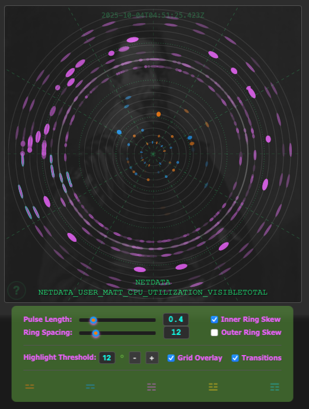
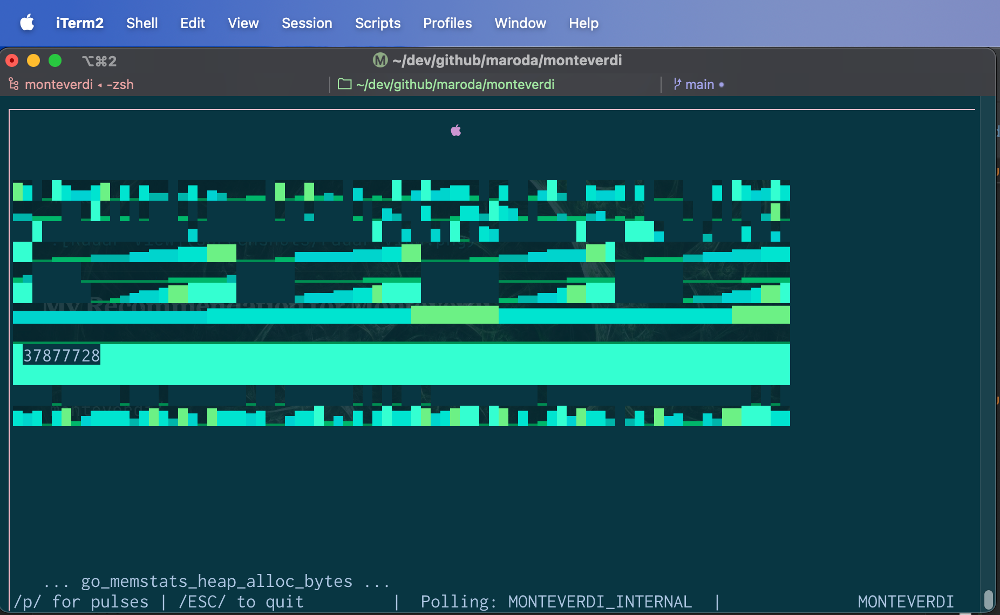

# Monteverdi

[](https://github.com/maroda/monteverdi/actions/workflows/release.yml)

## Quick Start

1. Get it: `docker run --network host ghcr.io/maroda/monteverdi:latest`
2. Browse to it: <http://localhost:8090>
3. Click **Metrics Data** to see the current metrics being consumed
4. Click **Value Editor** to manage the config or upload your own

See [How To Use](#how-to-use) for more startup docs and [Web UI](#web-ui) for visual controls.

## Seconda Practica Observability

Monteverdi is a live data streaming system that uses _Harmonic Accent Analysis_ to identify operational pulses of the system.

> This is an observability tool. It applies a musical analysis technique - invented by [Leonard Meyer](https://en.wikipedia.org/wiki/Leonard_B._Meyer) - to study how patterns **form** in the operation of technical (infra-)**structure**.
> 
> Monteverdi pays attention to the _pulse_ of how system patterns interact rather than the _rhythms_ of traditional monitoring.

Traditional monitoring observes individual component metric in isolation. Number hits a threshold, alert is fired, a component has failed... but we know little about total system behavior without piecing it together like a mystery to be solved.

Exploring new perspectives is how we emerge the art of monitoring, and _the interactions_ is where to look for new species of information.

This is where Monteverdi fits. It provides a doorway into analysis where system components interact, measured and displayed in converging patterns. In future iterations, this might be able to alert on emergent patterns, raising early warning signals and proactive views of failure.

New ways of understanding your system **as it lives** can give monitoring an entirely new perspective.

## What it can do now

Streams of data from multiple endpoints are used to draw histograms of "accents". These are found by configuring triggers, i.e. a maximum value for the metric being recorded.

An endpoint is any URL that serves K/V data (delimiter is configurable), for instance Prometheus or Netdata endpoints. Output can be enhanced with plugins that do simple math (e.g. `calc_rate` for counters to make them rates). These plugins are modular and are developed separately from Monteverdi core.

### Active Plugins

> Plugins are not required to use Monteverdi. The pattern recognition and pulse generation are core elements, while Plugins are used for extended functionality.
> 
> _Currently only one Output adapter can be used at a time, but that is usually what you want._

#### Transformer: calc_rate

Configure `transformer: calc_rate` to ingest a monotonically increasing value as a rate.
```json
      "go_memstats_alloc_bytes_total": {
        "type": "counter",
        "transformer": "calc_rate",
        "max": 20000000
      },
```

#### Transformer: json_key

Configure `transformer: json_key` to read an endpoint and extract data from a JSON blob.
```json
      "bitcoin.usd": {
        "type": "gauge",
        "transformer": "json_key",
        "max": 115200
      }
```

#### Output: BadgerDB

> Setting `MONTEVERDI_OUTPUT` to **any directory path** will run the BadgerDB output adapter at that path. It does not need to exist first.

This archives the stream of pulses to a local BadgerDB database.

_Future versions will have a query API and a way to replay pulses from an archive._

#### Output: MIDI

MIDI parameters are all controlled via Environment Variable.

> Setting `MONTEVERDI_OUTPUT=MIDI` will run the MIDI output, optional ENV VARs (defaults shown):
> 
> ```
> MONTEVERDI_PLUGIN_MIDI_PORT=0                 # Choose the MIDI device
> MONTEVERDI_PLUGIN_MIDI_ROOT=60                # Root for scales (60 = 'C4')
> MONTEVERDI_PLUGIN_MIDI_SCALE=0,2,2,1,2,2,2,1  # Scale default is Diatonic Major
> MONTEVERDI_PLUGIN_MIDI_ARP_INTERVAL=1         # Scale interval steps for Chords
> MONTEVERDI_PLUGIN_MIDI_ARP_DELAY=300          # Delay between arpeggio notes
> ```

- This requires a connected MIDI device. A list of tested hardware is below.
- Download the binary for your system from the releases page to use MIDI. MacOS and Linux are currently supported.
- The Docker image does not include support for MIDI output (but may include MIDI file output in the future).

When Monteverdi detects a pulse, it plays a note. The Plugin has an internal shift register of
notes, typically arranged like a scale, that cycle through all values over and over as it plays.

When pulses occur within 50ms of each other, they are grouped as a Chord.
With Polyphonic MIDI, a chord should play on the event. With Monophonic MIDI (like most
modular synths or boutique tabletops), the chord will be arpeggiated.

> MIDI Output has been tested with several devices so far:
> - **Winterbloom Sol** synth module
> - **Arturia Keystep37**
> - **IAC Driver** on MacOS (using a softsynth in Ableton Live)
> - Zoom U-44 built-in MIDI (beware of its small cache that can drop notes)
> 
> Details of the running MIDI configuration will be found on <http://localhost:8090/plugins.html>
> 
> Click the **Flush Output** button to clear all queued notes and send a MIDI _AllNotesOff_ message.
> This is helpful to do before quitting the app if it's playing so notes don't get stuck.

### Web UI



- Runs at <http://localhost:8090>
- Each metric in `config.json` gets its own ring.
- Rings are in alphabetical order by metric, grouped into 60 second and 10 minute dimensions.
- The inner group contains "Dimension 1" patterns: Iamb and Trochee. Dimension 1 patterns are based on the sequence of accent and no-accent in the raw data.
- The outer group contains "Dimension 2" patterns: Amphibrach (only, for now). These patterns are based on the Dimension 1 patterns, specifically the "Iamb, Trochee, Iamb" triplet. Dimension 2 patterns _consume_ Dimension 1 patterns.
- These patterns are not meant to signify anything but places in the data where accents are configured. Each dimension presents this pattern in different ways. The outcome is an _overall pattern among all data points_, not necessarily a direct measurement of system failure or success.

Monteverdi has a warmup period before it will show any pattern recognition. This is because it checks for a minimum number of accents (currently 10) to detect patterns, and if accents aren't triggered then patterns won't be detected. If no TTY is detected the logging is directed to STDOUT, otherwise logging is found in `monteverdi.log`.

#### Web UI Controls

There are three pages: **Harmony View**, **Metrics Data**, and **Value Editor**.

**Harmony View** has the concentric rings with data flowing around in 1 and 10 minute intervals. There are multiple ways to adjust the views to see your data in different perspectives, like:

- A grid overlay
- Ring spacing and pulse sizing
- Linear or exponential data views
- Metadata for pulses and rings
- Event animations

**Metrics Data** is a continuously updating table that shows all successfully fetched metrics from configured endpoints. Monteverdi will skip endpoints and metrics it cannot process (and logs the failure). _Use this view to verify that data is being ingested._

**Value Editor** is a simple but powerful interface to allow direct configuration edits. The running config is loaded in the JSON editor and can be changed directly. The entire config can be replaced, endpoints added or removed, or just max values adjusted. This page provides a single metric preview with live updating values to help with tuning the max in your config.

### Terminal UI



- This is the default view of Monteverdi when it is run in a TTY, parallel with the Web UI.
- There is a `-headless` runtime flag for no TTY (useful for running in a container)
- Draws the accent values in the display as they happen, with some color shading for different levels. This histogram view isn't available in the Web UI, and can be useful for debugging initial metric maximum value configurations.
- Graphs can be clicked on to reveal the metric name and its updating _raw_ value.
- Pattern recognition can be seen in the TUI if you hit 'p' for "pulse view" (but it is buggy, see known issues below). **The Web UI is the preferred interface to view patterns.**

### API

In addition to the prometheus `/metrics` endpoint, there is a `/version` endpoint for programmatically displaying the version in the Web UI, and a `/conf` endpoint that provides configuration updates. The Web UI uses all of these endpoints to operate.

> This API starts up regardless of whether TUI or Web Only is used.

## How to use

### Configuration File
Monteverdi reads any number of metrics from any number of endpoints.

You will need at least one endpoint configured. It should respond with a Key/Value format for metrics (e.g. Netdata, Prometheus). Populate these into a `config.json` in the same directory as running Monteverdi.

The fields are:

- **id**: The unique string ID of the endpoint where you're getting metrics. Small is best, it is displayed in the UI.
- **url**: The URL of that endpoint.
- **delim**: The delimiter used to indicate "key" and "value".
- **interval**: The duration between polls for each endpoint, in seconds.
- metric entries: **name**, **type**, **transformer (optional)**, **max**

> See `example_config.json` for a complex example, or `config.json` to play around with Monteverdi's own Prometheus stats.

### Configuration Endpoint

Use the `/conf` endpoint to update the configuration:

```shell
>>> curl -X POST http://localhost:8090/conf \
-H "Content-Type: application/json" \
-d @example_config.json
```

To retrieve the current configuration: `curl http://localhost:8090/conf`


### Runtime

Refer to the command help for any special configurations you wantNotes to make. The options and environment variables are listed:
```shell
>>> ./monteverdi -help
Monteverdi - Seconda Practica Observability

Usage: ./monteverdi [options]

Options:
  -config string
    	Path to configuration JSON (default "config.json")
  -headless
    	Container mode: no Terminal UI, logs sink to STDOUT

Environment Variables:
  MONTEVERDI_CONFIG_FILE
        Path to configuration file (default: config.json)
  MONTEVERDI_LOGLEVEL
        Log level: debug or info (default: info)
  MONTEVERDI_OUTPUT
        Location for output, currently sets a BadgerDB database path.
  MONTEVERDI_TUI_TSDB_VISUAL_WINDOW
        TUI display width in characters (default: 80)
  MONTEVERDI_PULSE_WINDOW_SECONDS
        Pulse lifecycle window in seconds (default: 3600)

Examples:
  ./monteverdi -config=/path/to/config.json
  ./monteverdi -headless
  MONTEVERDI_CONFIG_FILE=myconfig.json ./monteverdi

Run with no options to start the terminal UI with webserver (port 8090).
There is a short warmup before pulses will appear in the web UI.
Logs sink to ./monteverdi.log unless in -headless mode.
```

Currently its default size is 80x20, but you can set it to wider in your environment with:
```shell
MONTEVERDI_TUI_TSDB_VISUAL_WINDOW=100
```

Browse to <http://localhost:8090> for the web interface.

### Build Flags

This is done automatically by Goreleaser but if you need to iterate in the terminal, use the following to compile the git tag into the Version:
```shell
go build -ldflags "-X github.com/maroda/monteverdi/display.Version=$(git describe --tags --always)"
```

## Docker

This repo builds public container packages that you can use to try Monteverdi out for yourself. They can be run like this:
```shell
docker run -p 8090:8090 --network host ghcr.io/maroda/monteverdi:latest
```

The included `config.json` checks monteverdi's own `/metrics` endpoint, which requires the `--network host` part so that `localhost` works. When using public hostnames in `config.json`, this is not necessary.

To use your own config, set up the JSON and pass it to the container as a mount:
```shell
docker run -p 8090:8090 -v ./myconfig.json:/app/config.json ghcr.io/maroda/monteverdi:latest
```

Or use a different filename with an environment variable:
```shell
docker run -p 8090:8090 \
  -e MONTEVERDI_CONFIG_FILE=/app/myconfig.json \
  -v ./myconfig.json:/app/myconfig.json \
  ghcr.io/maroda/monteverdi:latest
```

## Kubernetes

You should be able to use a ConfigMap to run this in a Kubernetes cluster. This is an untested config, but should work!

Create the ConfigMap from your local JSON:
```shell
kubectl create configmap monteverdi-config --from-file=config.json
```

Once that is in place, an example manifest should look like:
```yaml
apiVersion: apps/v1
kind: Deployment
metadata:
  name: monteverdi
spec:
  replicas: 1
  selector:
    matchLabels:
      app: monteverdi
  template:
    metadata:
      labels:
        app: monteverdi
    spec:
      containers:
      - name: monteverdi
        image: ghcr.io/maroda/monteverdi:latest
        args: ["-headless"]
        ports:
        - containerPort: 8090
        volumeMounts:
        - name: config
          mountPath: /app/config.json
          subPath: config.json
      volumes:
      - name: config
        configMap:
          name: monteverdi-config
---
apiVersion: v1
kind: Service
metadata:
  name: monteverdi
spec:
  selector:
    app: monteverdi
  ports:
  - port: 8090
    targetPort: 8090
  type: LoadBalancer
```


## Known bugs

1. The Pulse View in the TUI is drawing weird, covering more space in the terminal than its configuration is supposed to be allowing.
2. Clicking on pulses in WebUI is inconsistent, sometimes the metadata popup will work, sometimes it's really difficult to trigger.

## Feature Requests

- Metrics input. Can read an existing timeseries with KV and extract pulses.
- Inference. How do we take a history of pulses and define expected behaviors?
- Monitor. How do we "alert" on pulse diversion?